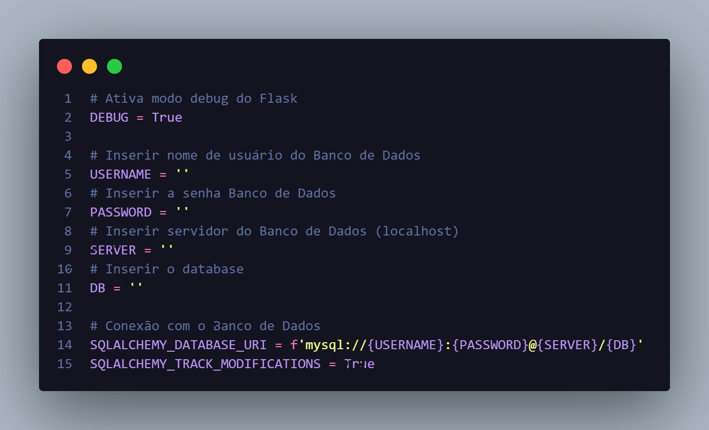

# API-RESTFul com Flask


Um CRUD completo de cadastro de cliente utilizando Flask e MySql.

## Indíce
- <a href="#diagramas">Diagramas</a>
- <a href="#arquivo-config-py">Arquivo Config.py</a>

## Diagramas


## Arquivo Config py
Antes de iniciar o projeto alterar as informações no arquivo ```config.py```
